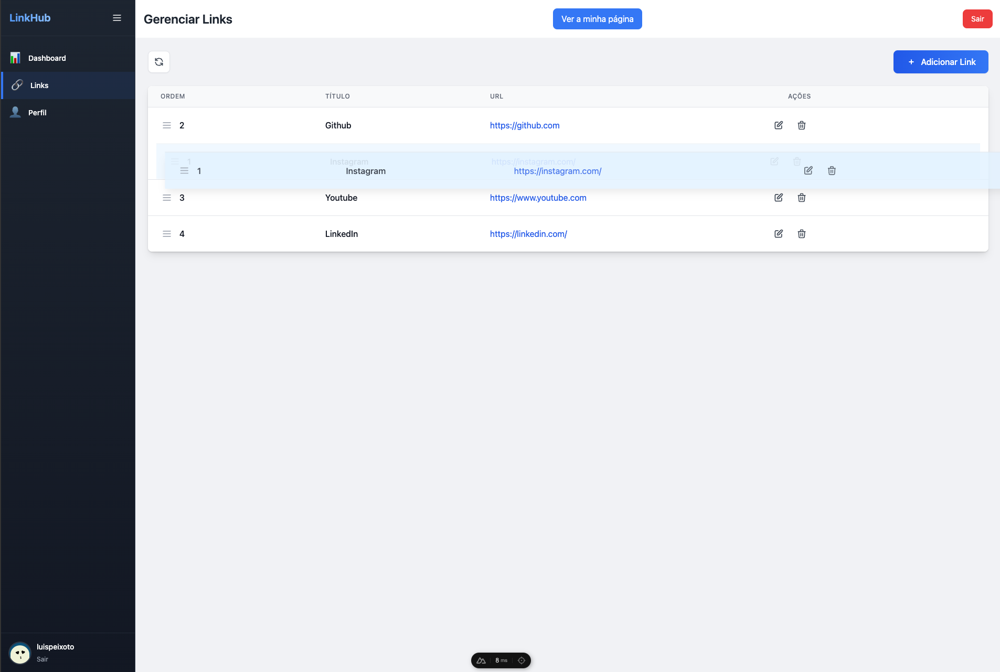
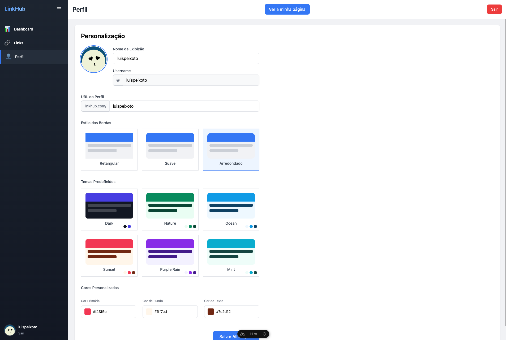

# LinkHub

O LinkHub é uma plataforma moderna para gestão e partilha de links pessoais, inspirada no Linktree, com funcionalidades avançadas de personalização e análise de métricas.

## 🌟 Destaques

- 🎨 Personalização visual avançada
- 📊 Sistema de métricas
- 🔄 Drag & drop para ordenação
- 📱 Design responsivo
- 👑 Painel de administração

## 🚀 Começar

O projeto está dividido em dois componentes principais:
- `linkhub-api/` - Backend em Node.js Express com MongoDB
- `frontend/` - Frontend em Vue.js/Nuxt.js

### Pré-requisitos

- Node.js (v16+)
- Docker e Docker Compose
- npm ou yarn

### Configuração do Ambiente

1. Clonar o repositório

```bash
git clone https://github.com/luispeixotoUA/LinkHub.git
cd LinkHub
```

2. Iniciar o MongoDB

```
docker-compose up -d
```

3. Configurar a API

```
cd linkhub-api
npm install
npm run start
```

4. Configure o Frontend

```
cd ../frontend
npm install
npm run dev
```

## 📚 Documentação

Para informações detalhadas sobre cada componente:
- [Documentação da API](./linkhub-api/README.md)
- [Documentação do Frontend](./frontend/README.md)

## 📸 Screenshots






## ✒️ Autor

* **Luis Peixoto** - *2402741*